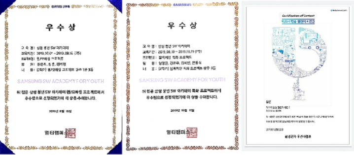

2019년은 내 인생에서 터닝포인트가 되는 해가 아니었나 싶다. 
전공면에서도 성향면에서도 많은 변화들이 있었고, 그 변화들이 좋은 변화들이었다고 생각한다. 
그리고 그 변화는 대부분 SSAFY를 통해서 오게되었다.

### SSAFY(삼성 청년 SW 아카데미)

4학년 2학기 졸업작품 발표를 앞두고 졸업 후 취업, 인턴, 대학원 등등 아직 진로를 정하지 못했었다.
마침, 영양사였던 친구가 이직을 하고싶다했는데 SSAFY라는 데에서 비전공자도 지원할 수 있다고 권해보다가 내눈에 들어와 지원하게 되었었다. 
알고리즘을 배워보고 싶기도 했고 돈도 지원해주는데다가 취업 시 퇴소도 가능하다하여 가벼운 마음으로 지원하게 되었다. 
 
 
### 1. 알고리즘
그런데 교육내용이 결코 가볍지가 않았다. 
대학시절 2년 정도는 수업에서 JAVA를 사용해왔기 때문에 딱히 걱정하지 않았는데.. JAVA한테 뒷통수 맞고 알고리즘에 호되게 당했다.
특히 알고리즘은 내가 아무리 열심히해도 여기있는 사람들을 뛰어넘을 수 있을까? 하는 생각이 컸고 실제로 자괴감도 많이 느껴졌다.  
그래서 알고리즘을 배우고부터는 한달넘게 고향에 가지않고 평일엔 새벽까지 공부하고 주말에도 스터디를 하며 공부했다. 
지금 생각해보면 조원들이 다들 열심히하고 실제로도 잘했기 때문에 안할수가 없는 분위기였다ㅋㅋ  
사람들과 코드배틀을하며 매일 같은 문제를 풀고 성능체크 및 깃 레파지토리를 통해 코드를 공유하던것도 많이 도움이 되었던 것 같다. 
특히 코드배틀을 통해 목표가 계속 생겼다고 해야하나? 
결국은 SW역량테스트에서 A등급에서 1년이 끝나버렸지만 다른사람이 A+을 받은 기분이 사실 이런 기분이 아니었을까

 
 
### 2. 프로젝트 경험
대학교 때 과제나 졸업작품을 진행해보면서 뭔갈 더 해보고싶은데 그게 무엇인지 어디서 정보를 얻어야하는지 잘 몰라 답답했던 경험이 있다. 
친구랑 공모전에 나가보려고 방학 때 준비해보다가 주제가 바뀌어서 흐지부지 끝났던적도 있었다. 
특히 목표가 맞는 친구가 없었던게 제일 아쉬웠다. 
그런점에서 SSAFY에서 얻은게 참 많다. 
 
1. safe food web project : Spring 기반으로 back-end와 front-end를 경험한 첫 스타트였다.  
2. 개인 blog web project : 개인적으로 제일 힘든 프로젝트였지만 제일 얻은것도 느낀것도 많았다.  
3. 블록체인을 이용한 P2P auction : 취준하며 가장 도움됐었고, 까마득했던 블록체인을 경험해보며 제일 재밌게 했었다.  
4. bixby 소중한아기 capsule : 시간이 많이 모자라서 아쉬웠지만 첫 공모전, 첫 입상의 경험을 만들어줬다.   

 
프로젝트 하나하나 할 때마다 새로운 기술과 교훈을 얻었고, safe food는 1점 차이로 수상하지 못했지만 나머지 프로젝트들은 수상을 하는 경험을 만들어주었다. 

### 취업준비
2019년 하반기를 시작으로 처음 취업시장에 뛰어들었지만, 결론적으로 아직 성공하지 못했다. 
현재 최종결과를 하나 기다리고 있긴 하지만 큰 기대는 해보지 않는다 ㅎㅎ..
사실 이 회사도 SSAFY JOB EXPO를 통해서 기회를 얻었고, 취업준비를 SSAFY를 통해서 했다고 해도 무방하다. 
SSAFY에서 취업 컨설턴트 류쌤에게 면접 시 인사하는 법, 복장 등과 같은 면접 노하우가 많은 도움이 되었다. 
 
 
2019년 하반기에 총 4군데의 회사에서 면접을 보게 되었는데 그래도 바쁜 프로젝트를 병행하며 첫 취준에서 나쁘지 않은 성과이지 않나 개인적으로는 생각한다. 
첫번째로 봤던 면접은 컨설턴트님의 도움 없이 갔었는데 긴장만 잔뜩하고 왔던 경험이 있다. 
그래도 덕분에 이후엔 열심히 연습해서 실전에는 잘 긴장하지 않고 약간의 두근거림을 즐기게 된것같다. 걱정은 산더미처럼 하지만ㅋㅋ
 
 
상반기에 SQLD, Opic을 준비했던것도 큰 도움이 되었다. 특히 타이밍 좋게 SW역량테스트에서 A등급을 취득한 덕에 삼성면접의 기회도 있었다. 
2018년 부터 뼈저리게 느꼈던 '노력은 배신하지 않는다'라는 문장이 올해에도 적용된것 같다. 
또 다른말로는 그만큼 노력을 안했나? 하는 의문이 들기도 하고..

### 2020년 목표 TOP3
1. 블록체인 이용한 프로젝트 하나 더 해보기 (공백기를 메꾸며)
2. 토익 점수 800점 이상 (높지 않았지만 소중했던 토익이 3월에 만료된다..)
3. 알고리즘 A+ 이상 따기

이외에도 많은 계획들이 있지만 2020년 회고에서 성공담으로 만나보길 바란다 하핫 :) 
회고를 마치며 2019년 스스로 생각하는 나의 장점은 매 순간을 즐기는 것, 단점은 잦은 합리화로 정리해보며 올해의 나는 어떤 삶을 살지 궁금해진다.
